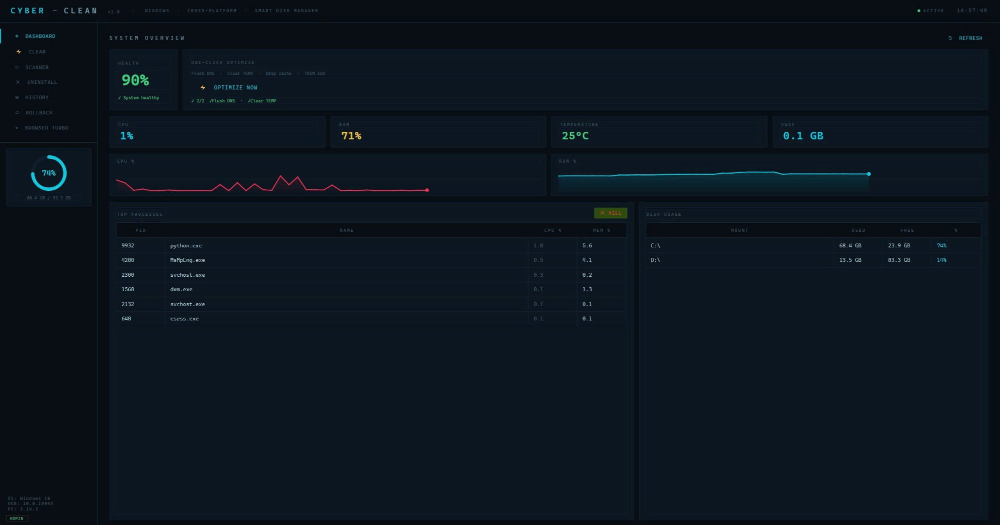
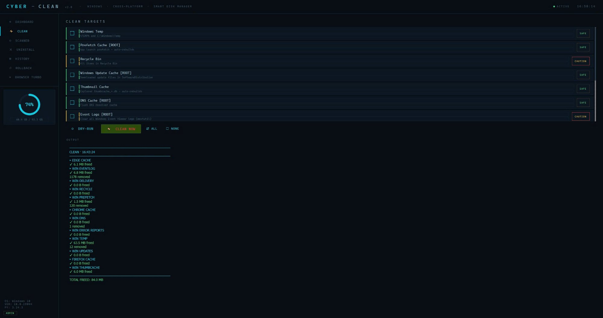
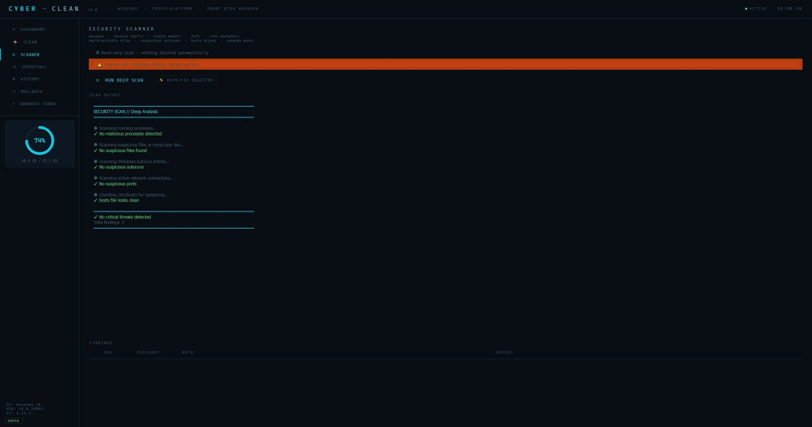

<div align="center">

```
  ██████╗██╗   ██╗██████╗ ███████╗██████╗      ██████╗██╗     ███████╗ █████╗ ███╗
 ██╔════╝╚██╗ ██╔╝██╔══██╗██╔════╝██╔══██╗    ██╔════╝██║     ██╔════╝██╔══██╗████╗
 ██║      ╚████╔╝ ██████╔╝█████╗  ██████╔╝    ██║     ██║     █████╗  ███████║██╔██╗
 ██║       ╚██╔╝  ██╔══██╗██╔══╝  ██╔══██╗    ██║     ██║     ██╔══╝  ██╔══██║██║╚██
 ╚██████╗   ██║   ██████╔╝███████╗██║  ██║    ╚██████╗███████╗███████╗██║  ██║██║ ╚█
  ╚═════╝   ╚═╝   ╚═════╝ ╚══════╝╚═╝  ╚═╝     ╚═════╝╚══════╝╚══════╝╚═╝  ╚═╝╚═╝
```

**Smart Disk Cleaner · v2.0 · Windows + Linux**

[](https://python.org)
[](https://pypi.org/project/PyQt6/)
[]()
[](LICENSE)
[](https://github.com/vuphitung/CyberClean/releases/latest)

<table>
<tr>
<td></td>
<td></td>
<td></td>
</tr>
<tr>
<td align="center"><b>Dashboard</b></td>
<td align="center"><b>Smart Clean</b></td>
<td align="center"><b>Security Scanner</b></td>
</tr>
</table>

</div>

---

## 📥 Installation

### 🐧 Linux
```bash
curl -sSL https://raw.githubusercontent.com/vuphitung/CyberClean/main/install.sh | sudo bash
```

**Uninstall:**
```bash
sudo cyberclean --uninstall
```

### 🪟 Windows
**[⬇ Download CyberClean_Setup_v2.0.0.exe](https://github.com/vuphitung/CyberClean/releases/latest)**

Uninstall via `Settings → Apps → CyberClean → Uninstall`

---

## ✨ Features

- **Dashboard** — Real-time CPU, RAM, Temperature, Disk · sparkline charts · Top processes
- **Smart Clean** — Dry-run preview before deleting · Safe / Caution targets
- **Security Scanner** — SUID files, world-writable paths, suspicious crontabs, open ports
- **App Uninstaller** — Registry-based (Windows) · pacman/apt/dnf (Linux) · no `wmic`
- **History & Rollback** — Every clean logged, files recoverable
- **Browser Turbo** — Clear cache, trackers, DNS prefetch, history
- **Auto-clean** — Runs safe targets every 6h while minimized to system tray

---

## 🌐 Compatibility

| OS | Supported |
|----|-----------|
| **Linux** | Arch · Manjaro · Ubuntu · Debian · Fedora · openSUSE and derivatives |
| **Windows** | Windows 10 · Windows 11 |

---

## 🔧 Build from source

```bash
# Linux AppImage
python3 build.py --linux

# Windows .exe + Inno Setup installer
python build.py --inno
```

---

## 🛡 Permissions

**Linux:** Sudoers rule scoped only to `/usr/local/bin/cyber-clean-helper` — no blanket sudo.  
**Windows:** Requires Administrator (UAC prompt on first launch).

---

## 📄 License

MIT — see [LICENSE](LICENSE)
