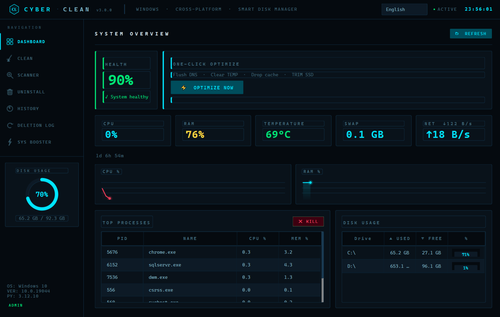
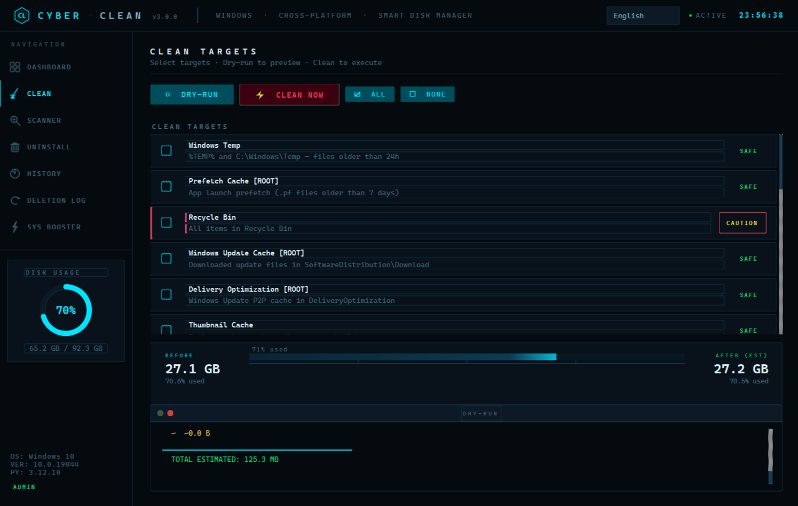
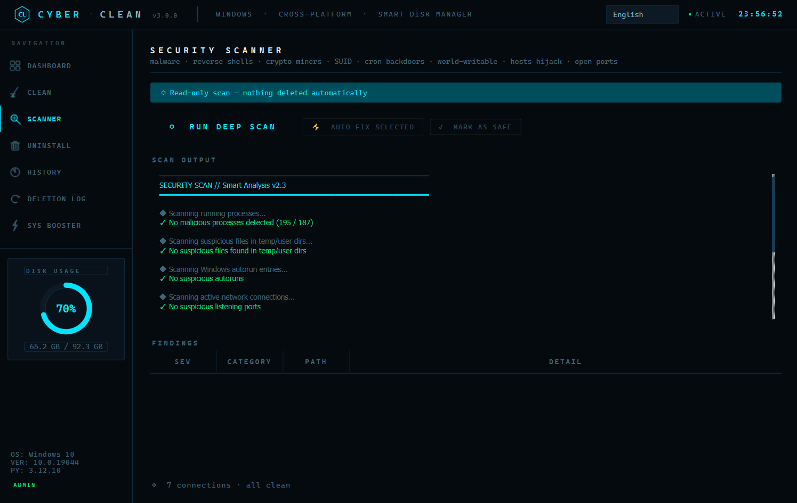

<div align="center">

```
  ██████╗██╗   ██╗██████╗ ███████╗██████╗      ██████╗██╗     ███████╗ █████╗ ███╗
 ██╔════╝╚██╗ ██╔╝██╔══██╗██╔════╝██╔══██╗    ██╔════╝██║     ██╔════╝██╔══██╗████╗
 ██║      ╚████╔╝ ██████╔╝█████╗  ██████╔╝    ██║     ██║     █████╗  ███████║██╔██╗
 ██║       ╚██╔╝  ██╔══██╗██╔══╝  ██╔══██╗    ██║     ██║     ██╔══╝  ██╔══██║██║╚██
 ╚██████╗   ██║   ██████╔╝███████╗██║  ██║    ╚██████╗███████╗███████╗██║  ██║██║ ╚█
  ╚═════╝   ╚═╝   ╚═════╝ ╚══════╝╚═╝  ╚═╝     ╚═════╝╚══════╝╚══════╝╚═╝  ╚═╝╚═╝
```

**Smart System Cleaner & Performance Optimizer**
**Windows · Linux · Cross-platform · v2.2.0**

<br/>

> 🌐 **Language:** **English** · [Tiếng Việt](README_vi.md)

<br/>

[](https://python.org)
[](https://pypi.org/project/PyQt6/)
[]()
[](LICENSE)
[](https://github.com/vuphitung/CyberClean/releases/latest)

<br/>

---

<!-- Security Badge -->
<table>
<tr>
<td align="center" width="560">

```
╔══════════════════════════════════════════════╗
║  ✔  MICROSOFT DEFENDER SCAN — NO THREAT      ║
║─────────────────────────────────────────────║
║  Result  :  No malicious code detected       ║
║  Engine  :  Microsoft Security Intelligence  ║
║  Sub ID  :  b632c14c-aff3-4ef6-97ab-...cd   ║
║  Status  :  Completed ✓                      ║
╚══════════════════════════════════════════════╝
```

**CyberClean passed an independent malware scan by Microsoft Defender.**
This is a self-submitted scan result — not a Microsoft partnership or endorsement.
No malicious code · No telemetry · No hidden behavior.

[](https://www.microsoft.com/en-us/wdsi/filesubmission)


</td>
</tr>
</table>

<br/>

---

<table>
<tr>
<td></td>
<td></td>
<td></td>
</tr>
<tr>
<td align="center"><b>📊 Dashboard</b></td>
<td align="center"><b>🧹 Smart Clean</b></td>
<td align="center"><b>🔍 Security Scanner</b></td>
</tr>
</table>

</div>

---

## 📥 Installation

### 🐧 Linux — One-line install

```bash
curl -sSL https://raw.githubusercontent.com/vuphitung/CyberClean/main/install.sh | sudo bash
```

> Installs to `/opt/CyberClean` · Creates `cyberclean` command · Registers app in launcher · Sets up NOPASSWD helper for safe privilege escalation

**Uninstall:**
```bash
sudo cyberclean --uninstall
```

### 🪟 Windows — Installer

**[⬇ Download CyberClean Setup v2.2.0 (.exe)](https://github.com/vuphitung/CyberClean/releases/latest)**

> UAC elevation on **first install only** · No background services · Uninstall via `Settings → Apps → CyberClean`

> 💡 **Tip:** Always launch CyberClean from the **Desktop or Start Menu shortcut** to avoid UAC prompts. Pinning the running app directly to the Taskbar bypasses the Auto-Admin rule and will trigger UAC on next launch — this is a Windows limitation shared by apps like MSI Afterburner and Rufus.

---

## ✨ Features

### 📊 Real-time Dashboard

Live system monitoring, auto-refreshes every 4 seconds.

- CPU usage per core with sparkline history chart
- RAM / Swap usage and available memory readout
- Disk usage rings per mount point
- Temperature monitoring — multi-source fallback (psutil → `/sys/thermal` → WMI → PowerShell → LibreHardwareMonitor)
- Top CPU and Memory processes with one-click kill
- Network I/O counters (sent / received)
- System uptime display
- Startup items manager (XDG autostart + systemd on Linux · Registry on Windows)

---

### 🧹 Smart Clean

Safe, reversible disk cleanup with dry-run preview before touching anything.
Every deletion is logged for manual rollback. Each target is labelled **Safe / Caution / Danger**.

| Target | Linux | Windows |
|--------|:-----:|:-------:|
| Package manager cache (pacman / apt / dnf / zypper) | ✅ | — |
| Orphaned packages | ✅ | — |
| AUR build cache (yay / paru) | ✅ | — |
| Flatpak unused runtimes | ✅ | — |
| Docker / Podman dangling images | ✅ | — |
| systemd journal logs (>7 days) | ✅ | — |
| User cache `~/.cache` — 3-layer smart guard | ✅ | — |
| Browser cache (Chrome / Chromium / Firefox / Edge / Brave / Opera) | ✅ | ✅ |
| Thumbnail cache | ✅ | ✅ |
| pip wheel cache | ✅ | — |
| Temp files (>3 days, not in use) | ✅ | — |
| Windows Temp & `%TEMP%` — lock-probe guard | — | ✅ |
| Prefetch cache (unused >7 days) | — | ✅ |
| Recycle Bin | — | ✅ |
| Windows Update cache | — | ✅ |
| Delivery Optimization cache | — | ✅ |
| Thumbnail cache DB | — | ✅ |
| DNS cache flush | — | ✅ |
| Event logs (wevtutil) | — | ✅ |
| Windows Error Reports & crash dumps | — | ✅ |

**Smart guard system (v2.2.0):**
- **3-layer Linux cache guard** — name whitelist → socket/FIFO type detection → recent-activity check. Unknown wallpaper daemons, compositors, and IPC tools are automatically protected without needing a name update.
- **Lock-probe Windows temp guard** — probes each file for an exclusive open before deleting. Locked files (held by a running process) are skipped silently instead of causing cascade errors.

---

### ⚡ System Booster

Performance optimization without crashing or freezing your system.

| Feature | Linux | Windows |
|---------|:-----:|:-------:|
| **Free RAM** — page cache drop + memory compact | ✅ | ✅ |
| **Memory Tune** — swappiness / dirty_ratio / vm params | ✅ | — |
| **Kill Bloat** — zombie + idle high-RAM processes (warm-up CPU sampling, no false positives) | ✅ | ✅ |
| **Clear GPU / Shader Cache** — mesa, NVIDIA, Chrome, Edge + Flatpak / Snap paths | ✅ | ✅ |
| **🎮 Game Mode** — 3-tier CPU affinity jail (Comms / Media / Trash) + performance governor + disable Windows Update/Search/Telemetry | ✅ | ✅ |
| **🌿 Eco Mode** — soft background throttle (BELOW_NORMAL on Windows, nice=5 on Linux) | ✅ | ✅ |
| **⚡ Smart Boost** — auto-detects PC tier (High / Mid / Low), applies the right strategy | ✅ | ✅ |

> **Game Mode** jails background apps into the last CPU cores so your game gets all prime cores — inspired by Process Lasso, Razer Cortex, and Feral GameMode.

> **Smart Boost** detects whether you're on a potato or a workstation and applies the appropriate combination: Game Mode only for high-end rigs, Game Mode + Eco + RAM free for low-end.

---

### 🔍 Security Scanner

Read-only deep scan — nothing is deleted automatically. You decide what to fix.

- **Running processes** — detect crypto miners, reverse shells, processes spawned from `/tmp`
- **SUID/SGID binaries** — flag unexpected setuid files outside the known-safe whitelist
- **World-writable system files** — `/etc`, `/usr/local/bin`, `/usr/bin`
- **Cron backdoors** — scan all cron directories + user crontab for shell injection patterns
- **Suspicious files** — `.sh/.py/.ps1/.bat/.vbs` in temp/user dirs with malicious patterns
- **LD_PRELOAD hijacks** — `/etc/ld.so.preload` and `$LD_PRELOAD` env check
- **SSH authorized_keys** — flag forced-command keys and unrecognised key formats (normal keys shown as info, not a warning)
- **Hosts file tampering** — detect redirects of trusted domains (Google, GitHub, PayPal...)
- **Suspicious listening ports** — 4444, 1337, 31337 and common RAT ports
- **Windows autoruns** — HKCU/HKLM Run keys with suspicious keywords (powershell -enc, mshta, wscript...)

---

### 🗑️ App Uninstaller

Remove installed applications cleanly, no leftovers.

- **Windows** — reads from Add/Remove Programs registry (no `wmic` dependency)
- **Linux** — native package manager (pacman / apt / dnf) integration
- Displays installed size, version, and install date
- Background uninstall with live progress log

---

### 📜 History & Rollback

- Every clean session is logged to `~/.local/share/cyber-clean/history.jsonl`
- Rollback log stores path, size, and type of every deleted item
- View full history with timestamps and freed space per session

---

### 🌐 Multi-language (i18n)

Built-in translations: **English · Tiếng Việt · 中文 · Español · Français · Deutsch · 日本語 · 한국어 · Русский · Português · العربية · Türkçe · Polski · Italiano**

---

### 🔔 System Tray & Auto-clean

- Minimize to system tray — stays out of your way
- **Auto-clean** runs `safe` targets every 6 hours while hidden in tray, only when the system is idle (CPU < 20%, network quiet)
- Auto-clean pauses automatically when Game Mode is active — no FPS drops
- Tray notification on completion

---

## 🌐 Compatibility

| OS | Distro / Version | Notes |
|----|-----------------|-------|
| **Linux** | Arch · Manjaro · EndeavourOS · Garuda · CachyOS | pacman + AUR |
| **Linux** | Ubuntu · Debian · Pop!_OS · Mint · Kali | apt |
| **Linux** | Fedora · CentOS · Rocky · AlmaLinux | dnf |
| **Linux** | openSUSE Leap / Tumbleweed | zypper |
| **Windows** | Windows 10 (1903+) | Full support |
| **Windows** | Windows 11 | Full support |

---

## 🛡️ Security & Privacy

- **No telemetry** — zero data collection, zero network calls during operation
- **No background service** — only runs when you open it (or auto-clean from tray)
- **Scoped privilege** — Linux sudoers rule grants access only to `/usr/local/bin/cyber-clean-helper`, not blanket sudo
- **Transparent helper** — all privileged operations go through a shell script you can read and audit
- **Windows UAC — ask once, never again** — installer creates a hidden Task Scheduler entry (`CyberClean_AutoAdmin`) at install time. Every subsequent launch via Desktop/Start Menu shortcut runs silently with no UAC prompt, even after reboot. The task is fully removed on uninstall.
- **Independent malware scan** — the `.exe` was self-submitted to Microsoft Defender's online scanner and returned clean. This is not a Microsoft partnership — it's a public scanning service anyone can use to verify a file. Submission ID: `b632c14c-aff3-4ef6-97ab-4058309bc4cd`

> ⚠️ **Taskbar pin note:** Right-clicking the running app and choosing "Pin to taskbar" pins the `.exe` directly — this bypasses the Auto-Admin task and UAC will reappear. Use the **Desktop or Start Menu shortcut** instead. This is a Windows limitation also seen in MSI Afterburner and Rufus.

---

## 🔧 Build from source

**Requirements:** Python 3.10+ · PyQt6 · psutil · PyInstaller

```bash
git clone https://github.com/vuphitung/CyberClean.git
cd CyberClean
pip install -r requirements.txt

# Run directly
python main.py

# Build Linux AppImage
python3 build.py --linux

# Build Windows .exe + Inno Setup installer
python build.py --inno
```

---

## 📁 Project Structure

```
CyberClean/
├── main.py                 # Main GUI (PyQt6)
├── core/
│   ├── base_cleaner.py     # Abstract cleaner interface
│   ├── linux_cleaner.py    # Linux clean targets — 3-layer smart guard
│   ├── windows_cleaner.py  # Windows clean targets — lock-probe guard
│   ├── scanner.py          # Security scanner
│   ├── booster.py          # RAM / CPU / Game Mode / Smart Boost optimizer
│   ├── analyzer.py         # Duplicate finder · Startup scorer · Network monitor
│   ├── uninstaller.py      # App uninstaller
│   └── os_detect.py        # OS / distro / package manager detection
├── utils/
│   ├── sysinfo.py          # psutil system snapshot (thread-safe cache)
│   └── i18n.py             # 14-language translations
├── assets/
│   ├── logo.png            # App icon
│   ├── logo.ico            # Windows icon
│   └── icons/              # QPainter-drawn nav icons (no SVG files)
├── LibreHardwareMonitorLib.dll  # Windows temperature (MSR kernel driver)
└── install.sh              # Linux one-line installer
```

---

## 📄 License

MIT — see [LICENSE](LICENSE)

---

<div align="center">

Made with ☕ by [vuphitung](https://github.com/vuphitung) — a Vietnamese student 🇻🇳

*If CyberClean helped you reclaim disk space or boost performance, consider giving it a ⭐*

🌐 [Xem README tiếng Việt](README.vi.md)

</div>
