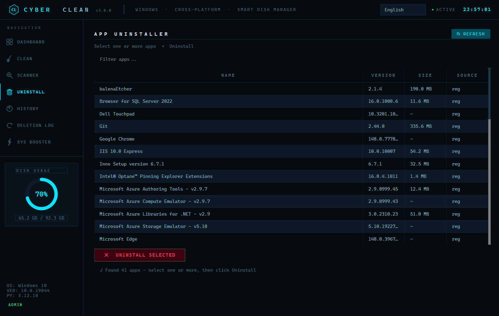
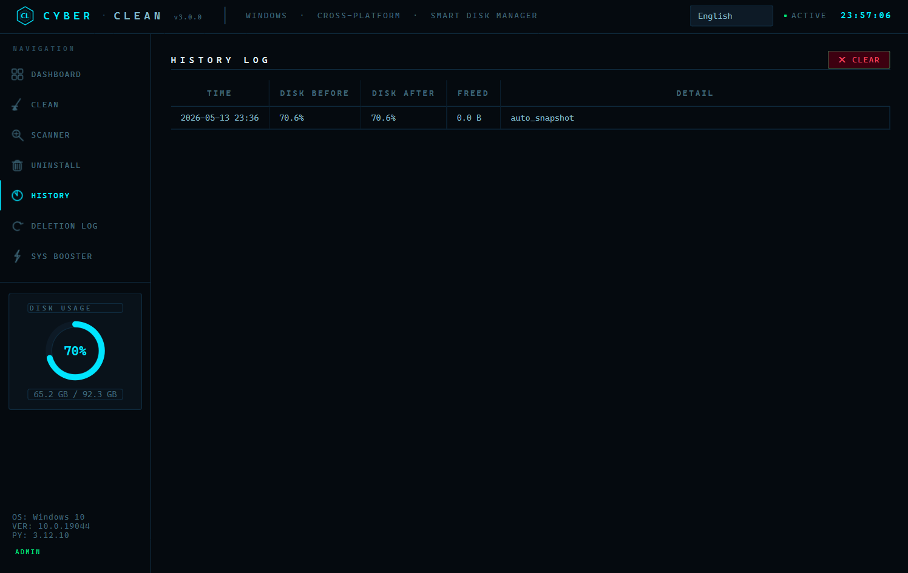
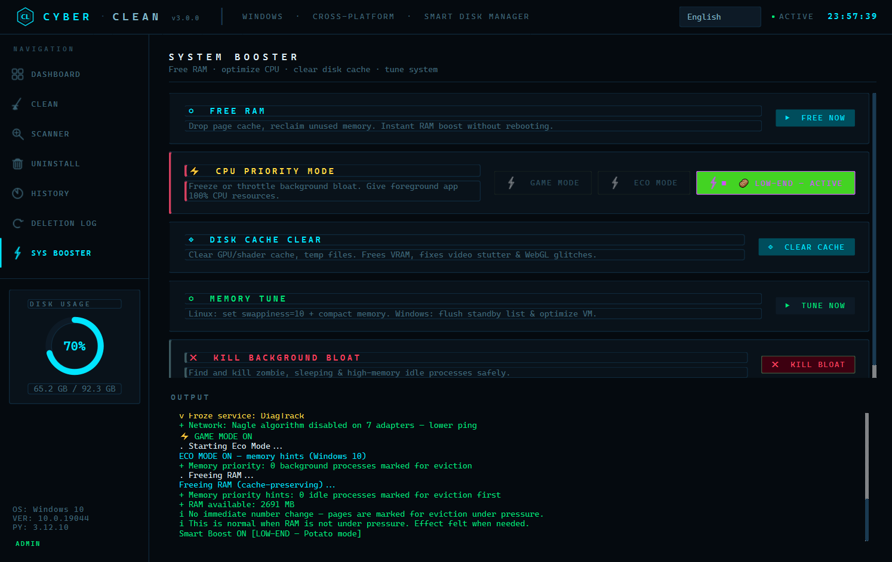

<div align="center">

```
  ██████╗██╗   ██╗██████╗ ███████╗██████╗      ██████╗██╗     ███████╗ █████╗ ███╗
 ██╔════╝╚██╗ ██╔╝██╔══██╗██╔════╝██╔══██╗    ██╔════╝██║     ██╔════╝██╔══██╗████╗
 ██║      ╚████╔╝ ██████╔╝█████╗  ██████╔╝    ██║     ██║     █████╗  ███████║██╔██╗
 ██║       ╚██╔╝  ██╔══██╗██╔══╝  ██╔══██╗    ██║     ██║     ██╔══╝  ██╔══██║██║╚██
 ╚██████╗   ██║   ██████╔╝███████╗██║  ██║    ╚██████╗███████╗███████╗██║  ██║██║ ╚█
  ╚═════╝   ╚═╝   ╚═════╝ ╚══════╝╚═╝  ╚═╝     ╚═════╝╚══════╝╚══════╝╚═╝  ╚═╝╚═╝
```

**Công cụ Dọn dẹp & Tối ưu Hiệu năng Hệ thống**

[](https://python.org)
[](https://pypi.org/project/PyQt6/)
[](https://github.com/vuphitung/CyberClean/releases/latest)
[](LICENSE)
[](https://github.com/vuphitung/CyberClean/releases/latest)

🌐 **Ngôn ngữ / Language:** [English](README.md) · **Tiếng Việt**

</div>

---

## Screenshots
---

<p align="center">
  
</p>
---

<p align="center">
  
</p>
---

<p align="center">
  
</p>
---

<p align="center">
  
</p>
---

<p align="center">
  
</p>
---

<p align="center">
  
</p>
---


## Cài đặt

### Linux

```bash
curl -sSL https://raw.githubusercontent.com/vuphitung/CyberClean/main/install.sh | sudo bash
```

Cài vào `/opt/CyberClean` · tạo lệnh `cyberclean` · đăng ký app vào launcher · thiết lập helper đặc quyền có phạm vi giới hạn.

**Gỡ cài đặt:**
```bash
sudo cyberclean --uninstall
```

### Windows

**[⬇ Tải CyberClean Setup v3.0.0 (.exe)](https://github.com/vuphitung/CyberClean/releases/latest)**

Chỉ hỏi UAC một lần lúc cài. Gỡ qua `Cài đặt → Ứng dụng → CyberClean`.

---

## Tính năng

### [◈] Bảng điều khiển
Thống kê hệ thống thời gian thực, tự làm mới mỗi 4 giây.

- CPU / RAM / Swap / Nhiệt độ / Lưu lượng mạng
- Danh sách tiến trình nặng, tắt ngay một click
- Dung lượng ổ đĩa từng phân vùng
- Thời gian hoạt động · Quản lý ứng dụng khởi động cùng hệ thống

---

### [✦] Dọn dẹp Thông minh
Xem trước (dry-run) trước khi xóa bất cứ thứ gì. Mọi thao tác đều được ghi log. Mỗi mục được gắn nhãn **An toàn / Cẩn thận / Nguy hiểm**.

**Linux** — cache trình quản lý gói (pacman / apt / dnf / zypper / xbps), gói mồ côi, cache AUR build, Flatpak runtime cũ, Docker/Podman image rác, Snap bản cũ, journal log, cache trình duyệt, cache pip, thumbnail cache, file tạm.

**Windows** — Temp & `%TEMP%`, Prefetch, Thùng rác, Windows Update cache, Delivery Optimization, Thumbnail DB, Font Cache, GPU Shader Cache, WinSxS, DNS flush, Event log, WER crash dump, cache trình duyệt (Chrome / Edge / Brave / Firefox / Vivaldi / Cốc Cốc).

---

### [⚡] System Booster
Tối ưu hiệu năng không gây crash. Mọi thay đổi đều có thể hoàn tác hoàn toàn.

- **Giải phóng RAM** — nén bộ nhớ không cần dùng mà không ảnh hưởng page cache
- **Memory Tune** — swappiness / vm params (Linux) · trim working set tiến trình nhàn rỗi (Windows)
- **Kill Bloat** — loại bỏ tiến trình zombie và ngốn RAM nhưng không làm gì
- **Xóa GPU / Shader Cache** — mesa, NVIDIA, Chrome, Edge
- **[◈] Game Mode** — CPU jail 3 tầng, dồn toàn bộ tài nguyên cho app foreground
- **[~] Eco Mode** — cgroups v2 (Linux) · EcoQoS + memory priority (Windows 11)
- **[★] Smart Boost** — tự phân loại máy (High / Mid / Low) theo RAM + core + GPU VRAM
- **Tắt TCP Nagle** — giảm ping game online (Windows)
- **Timer Resolution 1ms** — frame mượt hơn (Windows)

---

### [◉] Security Scanner
Quét chỉ đọc — không tự xóa bất cứ thứ gì. Bạn quyết định xử lý cái gì.

Quét: tiến trình đang chạy · kết nối TCP ra ngoài · file SUID/SGID · file hệ thống có quyền ghi toàn cục · cron backdoor · script đáng ngờ trong thư mục tạm · LD_PRELOAD hijack · SSH authorized_keys · file hosts bị sửa · Windows autorun.

Mỗi tiến trình qua ma trận chấm điểm đa chiều (+/− điểm theo từng dấu hiệu). Điểm ≥ 70 → nghiêm trọng. Điểm 40–69 → watchlist, kiểm tra lại mỗi 5 phút.

> Không phát hiện được rootkit Ring-0 hay UEFI implant. Phát hiện tốt: miner, reverse shell, cron backdoor, hosts hijack, script chạy từ `/tmp`.

---

### [≡] Gỡ cài đặt ứng dụng
- **Windows** — đọc từ registry Add/Remove Programs (không dùng `wmic`)
- **Linux** — tích hợp pacman / apt / dnf
- Hiển thị dung lượng, phiên bản, nguồn cài
- Gỡ nền với log tiến trình trực tiếp

---

### [↺] Lịch sử & Log xóa
- Mỗi phiên dọn dẹp được ghi vào `~/.local/share/cyber-clean/history.jsonl`
- Audit trail đầy đủ: đường dẫn, kích thước, loại của từng file bị xóa
- Xem dung lượng đã giải phóng theo từng phiên

---

### [↑] Tự động cập nhật
Kiểm tra GitHub Releases lúc khởi động (chạy nền, không block UI). Tải xuống → thay thế → khởi động lại chỉ một click.

---

### [♪] System Tray & Tự động dọn
Thu nhỏ xuống khay hệ thống. Tự động dọn các mục an toàn mỗi 6 tiếng khi máy nhàn rỗi (CPU < 20%, mạng < 500 KB/s). Tự tạm dừng khi Game Mode đang bật.

---

## Tương thích

| Hệ điều hành | Phiên bản | Ghi chú |
|---|---|---|
| Linux | Arch · Manjaro · EndeavourOS · CachyOS | pacman |
| Linux | Ubuntu · Debian · Pop!_OS · Mint · Kali | apt |
| Linux | Fedora · CentOS · Rocky · Nobara | dnf |
| Linux | openSUSE Leap / Tumbleweed | zypper |
| Linux | Void Linux | xbps |
| Windows | 10 (1903+) | Đầy đủ |
| Windows | 11 | Đầy đủ + EcoQoS |
| Windows | ARM64 (Surface Pro X, Snapdragon) | Hỗ trợ |

---

## Bảo mật & Quyền riêng tư

- **Không thu thập dữ liệu** — không gọi mạng trong lúc hoạt động bình thường
- **Không chạy ngầm** — chỉ chạy khi bạn mở app
- **Đặc quyền có phạm vi** — sudoers rule chỉ cấp quyền cho `/usr/local/bin/cyber-clean-helper`, không phải sudo toàn bộ. Helper là shell script bạn có thể đọc và kiểm tra.
- **send2trash** — file bị xóa đưa vào Thùng rác hệ thống khi có thể, không xóa vĩnh viễn

---

## Build từ mã nguồn

```bash
git clone https://github.com/vuphitung/CyberClean.git
cd CyberClean
pip install -r requirements.txt

# Chạy trực tiếp
python main.py

# Build binary Linux
python3 build.py --linux

# Build installer Windows
python build.py --inno
```

**Yêu cầu:** Python 3.10+ · PyQt6 · psutil · PyInstaller

---

## Cấu trúc dự án

```
CyberClean/
├── main.py                 # Giao diện chính (PyQt6)
├── version.py              # Nguồn duy nhất cho số phiên bản
├── core/
│   ├── base_cleaner.py     # Interface cleaner trừu tượng
│   ├── linux_cleaner.py    # Mục dọn dẹp Linux
│   ├── windows_cleaner.py  # Mục dọn dẹp Windows
│   ├── scanner.py          # Quét bảo mật
│   ├── booster.py          # RAM / CPU / Game Mode / Smart Boost
│   ├── analyzer.py         # Lập lịch nhàn rỗi · xem mạng
│   ├── uninstaller.py      # Gỡ cài đặt ứng dụng
│   └── os_detect.py        # Phát hiện OS / distro / package manager
├── utils/
│   ├── sysinfo.py          # Snapshot hệ thống qua psutil
│   ├── i18n.py             # Dịch 11 ngôn ngữ
│   └── updater.py          # Tự động cập nhật OTA
├── assets/
│   └── logo.png
├── LibreHardwareMonitorLib.dll  # Cảm biến nhiệt độ Windows
└── install.sh              # Trình cài đặt Linux một lệnh
```

---

## Ngôn ngữ

English · Tiếng Việt 

---

## Giấy phép

MIT — xem [LICENSE](LICENSE)

---

<div align="center">

Made with ☕ by [vuphitung](https://github.com/vuphitung) — sinh viên Việt Nam 🇻🇳

*Nếu CyberClean có ích với bạn, hãy cho một ⭐ nhé*

🌐 [View English README](README.md)

</div>
