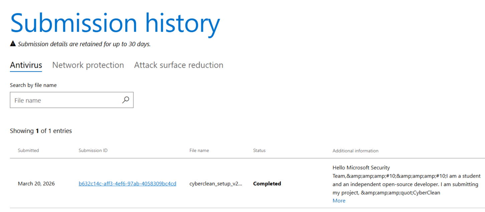
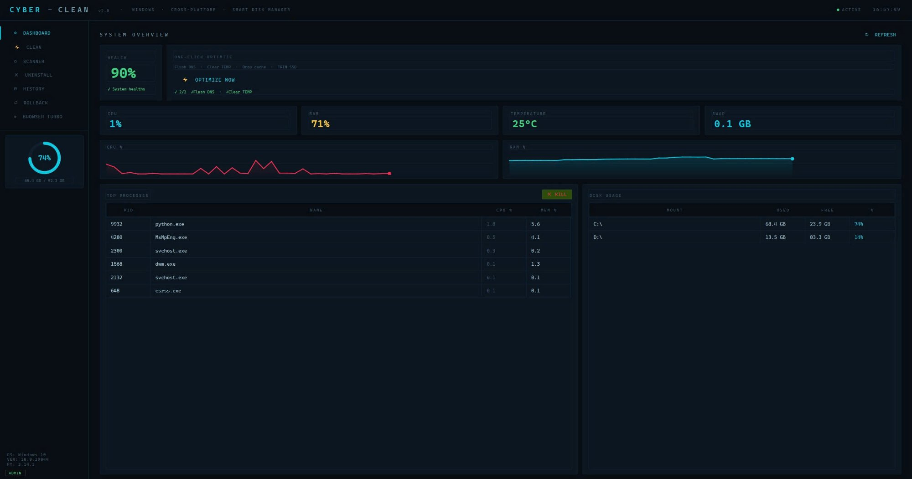
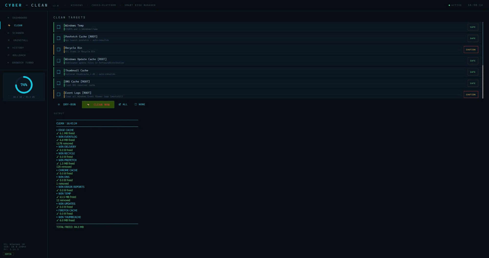
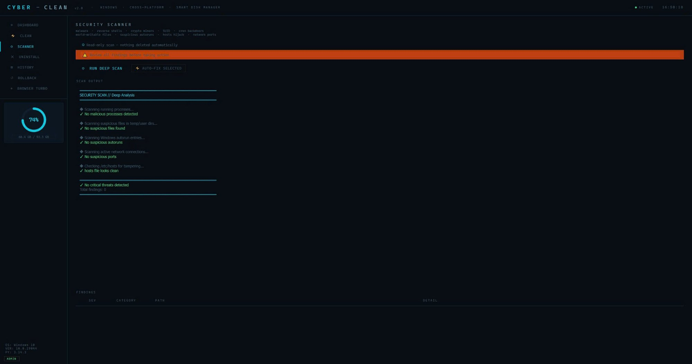

<div align="center">

```
  ██████╗██╗   ██╗██████╗ ███████╗██████╗      ██████╗██╗     ███████╗ █████╗ ███╗
 ██╔════╝╚██╗ ██╔╝██╔══██╗██╔════╝██╔══██╗    ██╔════╝██║     ██╔════╝██╔══██╗████╗
 ██║      ╚████╔╝ ██████╔╝█████╗  ██████╔╝    ██║     ██║     █████╗  ███████║██╔██╗
 ██║       ╚██╔╝  ██╔══██╗██╔══╝  ██╔══██╗    ██║     ██║     ██╔══╝  ██╔══██║██║╚██
 ╚██████╗   ██║   ██████╔╝███████╗██║  ██║    ╚██████╗███████╗███████╗██║  ██║██║ ╚█
  ╚═════╝   ╚═╝   ╚═════╝ ╚══════╝╚═╝  ╚═╝     ╚═════╝╚══════╝╚══════╝╚═╝  ╚═╝╚═╝
```

**Công cụ Dọn dẹp & Tối ưu Hiệu năng Hệ thống**
**Windows · Linux · Đa nền tảng · v2.2.0**

<br/>

> 🌐 **Ngôn ngữ:** [English](README.md) · **Tiếng Việt**

<br/>

[](https://python.org)
[](https://pypi.org/project/PyQt6/)
[]()
[](LICENSE)
[](https://github.com/vuphitung/CyberClean/releases/latest)

<br/>

---

<!-- Security Badge -->
<table>
<tr>
<td align="center" width="560">

```
╔══════════════════════════════════════════════╗
║  ✔  MICROSOFT DEFENDER SCAN — SẠCH          ║
║─────────────────────────────────────────────║
║  Kết quả  :  Không phát hiện mã độc         ║
║  Engine   :  Microsoft Security Intelligence ║
║  Sub ID   :  b632c14c-aff3-4ef6-97ab-...cd  ║
║  Trạng thái:  Hoàn tất ✓                    ║
╚══════════════════════════════════════════════╝
```

**CyberClean đã được quét độc lập bởi Microsoft Defender và không có mối đe dọa nào được phát hiện.**
Đây là kết quả tự nộp file để quét — không phải hợp tác hay chứng nhận từ Microsoft.
Không mã độc · Không thu thập dữ liệu · Không hành vi ẩn.

[](https://www.microsoft.com/en-us/wdsi/filesubmission)



</td>
</tr>
</table>

<br/>

---

<table>
<tr>
<td></td>
<td></td>
<td></td>
</tr>
<tr>
<td align="center"><b>📊 Dashboard</b></td>
<td align="center"><b>🧹 Dọn dẹp thông minh</b></td>
<td align="center"><b>🔍 Quét bảo mật</b></td>
</tr>
</table>

</div>

---

## 📥 Cài đặt

### 🐧 Linux — Cài bằng 1 lệnh

```bash
curl -sSL https://raw.githubusercontent.com/vuphitung/CyberClean/main/install.sh | sudo bash
```

> Cài vào `/opt/CyberClean` · Tạo lệnh `cyberclean` · Đăng ký app trong launcher · Thiết lập helper NOPASSWD để leo quyền an toàn

**Gỡ cài đặt:**
```bash
sudo cyberclean --uninstall
```

### 🪟 Windows — Bộ cài đặt

**[⬇ Tải CyberClean Setup v2.2.0 (.exe)](https://github.com/vuphitung/CyberClean/releases/latest)**

> Chỉ hỏi UAC **đúng 1 lần khi cài đặt** · Không cài service nền · Gỡ qua `Cài đặt → Ứng dụng → CyberClean`

> 💡 **Mẹo:** Luôn mở CyberClean bằng **shortcut trên Desktop hoặc Start Menu** để không bị hỏi UAC. Nếu ghim app đang chạy thẳng vào Taskbar, Windows sẽ ghim file `.exe` thay vì shortcut — UAC sẽ xuất hiện lại. Đây là giới hạn của Windows, các app như MSI Afterburner hay Rufus cũng bị tương tự.

---

## ✨ Tính năng

### 📊 Dashboard — Giám sát thời gian thực

Theo dõi hệ thống live, tự làm mới mỗi 4 giây.

- Mức dùng CPU theo từng nhân, kèm biểu đồ sparkline lịch sử
- RAM / Swap đang dùng và dung lượng còn trống
- Vòng tròn dung lượng ổ đĩa theo từng phân vùng
- Nhiệt độ CPU/GPU — fallback đa nguồn (psutil → `/sys/thermal` → WMI → PowerShell → LibreHardwareMonitor)
- Top tiến trình ngốn CPU và RAM nhất, kill bằng 1 click
- Thống kê mạng (đã gửi / đã nhận)
- Thời gian hoạt động hệ thống
- Quản lý ứng dụng khởi động cùng máy (XDG autostart + systemd trên Linux · Registry trên Windows)

---

### 🧹 Dọn dẹp thông minh

Dọn dẹp ổ đĩa an toàn, có thể phục hồi — xem trước bằng dry-run trước khi xóa thật.
Mỗi lần xóa đều được ghi log để rollback thủ công. Mỗi mục tiêu được gắn nhãn **An toàn / Cẩn thận / Nguy hiểm**.

| Mục tiêu dọn dẹp | Linux | Windows |
|-----------------|:-----:|:-------:|
| Cache package manager (pacman / apt / dnf / zypper) | ✅ | — |
| Gói phần mềm mồ côi (orphaned packages) | ✅ | — |
| Cache build AUR (yay / paru) | ✅ | — |
| Flatpak runtime không dùng | ✅ | — |
| Docker / Podman image rác | ✅ | — |
| Log systemd journal (>7 ngày) | ✅ | — |
| Cache người dùng `~/.cache` — bảo vệ 3 tầng thông minh | ✅ | — |
| Cache trình duyệt (Chrome / Chromium / Firefox / Edge / Brave / Opera) | ✅ | ✅ |
| Cache thumbnail | ✅ | ✅ |
| Cache pip wheel | ✅ | — |
| File tạm (>3 ngày, không đang dùng) | ✅ | — |
| Windows Temp & `%TEMP%` — kiểm tra lock trước khi xóa | — | ✅ |
| Prefetch cache (không dùng >7 ngày) | — | ✅ |
| Thùng rác | — | ✅ |
| Cache Windows Update | — | ✅ |
| Cache Delivery Optimization | — | ✅ |
| Thumbnail cache DB | — | ✅ |
| Xóa DNS cache | — | ✅ |
| Event logs (wevtutil) | — | ✅ |
| Báo lỗi & crash dump Windows | — | ✅ |

**Hệ thống bảo vệ thông minh (v2.2.0):**
- **Bảo vệ 3 tầng cho Linux** — whitelist tên → phát hiện socket/FIFO → kiểm tra hoạt động gần đây. Wallpaper daemon, compositor hay IPC tool lạ đều được tự động bảo vệ mà không cần thêm tên vào danh sách.
- **Kiểm tra lock cho Windows temp** — thử mở file exclusive trước khi xóa. File đang bị giữ bởi process khác sẽ được bỏ qua im lặng, không gây lỗi dây chuyền.

---

### ⚡ System Booster — Tăng tốc hệ thống

Tối ưu hiệu năng mà không làm crash hay đơ máy.

| Tính năng | Linux | Windows |
|-----------|:-----:|:-------:|
| **Giải phóng RAM** — xóa page cache + compact memory | ✅ | ✅ |
| **Memory Tune** — swappiness / dirty_ratio / tham số VM | ✅ | — |
| **Kill Bloat** — diệt tiến trình zombie + idle ngốn RAM (warm-up CPU sampling, không kill nhầm) | ✅ | ✅ |
| **Xóa GPU / Shader Cache** — mesa, NVIDIA, Chrome, Edge + đường dẫn Flatpak / Snap | ✅ | ✅ |
| **🎮 Game Mode** — nhốt app nền vào nhân CPU cuối (3 tầng: Comms / Media / Trash) + đổi governor sang performance + tắt Windows Update/Search/Telemetry | ✅ | ✅ |
| **🌿 Eco Mode** — giảm nhẹ ưu tiên app nền (BELOW_NORMAL trên Windows, nice=5 trên Linux) | ✅ | ✅ |
| **⚡ Smart Boost** — tự phân tích cấu hình máy (Cao / Trung / Yếu), áp chiến lược phù hợp | ✅ | ✅ |

> **Game Mode** nhốt các app nền vào nhân CPU cuối để game nhận toàn bộ nhân chính — lấy cảm hứng từ Process Lasso, Razer Cortex và Feral GameMode.

> **Smart Boost** tự nhận dạng cấu hình máy rồi áp chiến lược phù hợp: chỉ Game Mode cho máy mạnh, kết hợp Game Mode + Eco + Free RAM cho máy yếu.

---

### 🔍 Quét bảo mật

Quét chỉ đọc — không tự động xóa bất cứ thứ gì. Bạn là người quyết định.

- **Tiến trình đang chạy** — phát hiện crypto miner, reverse shell, tiến trình spawn từ `/tmp`
- **File SUID/SGID** — cảnh báo file setuid bất thường ngoài danh sách trắng đã biết
- **File world-writable trong thư mục hệ thống** — `/etc`, `/usr/local/bin`, `/usr/bin`
- **Backdoor trong cron** — quét toàn bộ thư mục cron + crontab người dùng tìm shell injection
- **File đáng ngờ** — `.sh/.py/.ps1/.bat/.vbs` trong thư mục tạm/user có pattern độc hại
- **Hijack LD_PRELOAD** — kiểm tra `/etc/ld.so.preload` và biến môi trường `$LD_PRELOAD`
- **SSH authorized_keys** — chỉ cảnh báo key có `command=` (forced execution) hoặc format lạ — key bình thường chỉ hiển thị thông tin, không báo lỗi
- **Giả mạo file hosts** — phát hiện redirect tên miền uy tín (Google, GitHub, PayPal...)
- **Cổng nghe đáng ngờ** — 4444, 1337, 31337 và các cổng RAT phổ biến
- **Windows autoruns** — HKCU/HKLM Run keys chứa từ khóa nguy hiểm (powershell -enc, mshta, wscript...)

---

### 🗑️ Gỡ cài đặt ứng dụng

Gỡ bỏ phần mềm sạch sẽ, không để lại rác.

- **Windows** — đọc từ registry Add/Remove Programs (không dùng `wmic`)
- **Linux** — tích hợp trực tiếp với pacman / apt / dnf
- Hiển thị dung lượng, phiên bản và ngày cài đặt
- Gỡ cài đặt chạy nền với log tiến trình trực tiếp

---

### 📜 Lịch sử & Phục hồi

- Mỗi lần dọn dẹp đều được ghi vào `~/.local/share/cyber-clean/history.jsonl`
- Nhật ký rollback lưu đường dẫn, dung lượng và loại của từng mục đã xóa
- Xem toàn bộ lịch sử với timestamp và dung lượng đã giải phóng theo từng phiên

---

### 🌐 Đa ngôn ngữ

Hỗ trợ sẵn: **Tiếng Việt · English · 中文 · Español · Français · Deutsch · 日本語 · 한국어 · Русский · Português · العربية · Türkçe · Polski · Italiano**

---

### 🔔 System Tray & Tự động dọn dẹp

- Thu nhỏ xuống system tray — không chiếm màn hình
- **Tự động dọn dẹp** chạy các mục `an toàn` mỗi 6 tiếng khi đang ẩn trong tray, chỉ khi máy thực sự rảnh (CPU < 20%, mạng yên tĩnh)
- Tự động tạm dừng khi Game Mode đang bật — không làm giảm FPS
- Thông báo tray khi hoàn thành

---

## 🌐 Tương thích

| Hệ điều hành | Distro / Phiên bản | Ghi chú |
|-------------|-------------------|---------|
| **Linux** | Arch · Manjaro · EndeavourOS · Garuda · CachyOS | pacman + AUR |
| **Linux** | Ubuntu · Debian · Pop!_OS · Mint · Kali | apt |
| **Linux** | Fedora · CentOS · Rocky · AlmaLinux | dnf |
| **Linux** | openSUSE Leap / Tumbleweed | zypper |
| **Windows** | Windows 10 (1903 trở lên) | Hỗ trợ đầy đủ |
| **Windows** | Windows 11 | Hỗ trợ đầy đủ |

---

## 🛡️ Bảo mật & Quyền riêng tư

- **Không thu thập dữ liệu** — không gửi bất kỳ thông tin nào, không gọi mạng khi hoạt động
- **Không cài service nền** — chỉ chạy khi bạn mở app (hoặc auto-clean từ tray)
- **Quyền hạn được giới hạn chặt** — sudoers rule trên Linux chỉ cấp quyền cho `/usr/local/bin/cyber-clean-helper`, không phải sudo toàn bộ
- **Helper script minh bạch** — mọi thao tác cần quyền đều đi qua script shell bạn có thể đọc và kiểm tra
- **Windows UAC — hỏi 1 lần, không hỏi lại** — installer tạo Task Scheduler ẩn (`CyberClean_AutoAdmin`) ngay khi cài. Mọi lần mở sau qua shortcut Desktop/Start Menu đều chạy thẳng, không hỏi UAC. Task bị xóa sạch khi gỡ cài đặt.
- **Kết quả quét độc lập** — file `.exe` được tự nộp lên dịch vụ quét của Microsoft Defender và trả về sạch. Đây là dịch vụ công khai ai cũng có thể dùng để xác minh file, **không phải hợp tác hay chứng nhận từ Microsoft**. Mã submission: `b632c14c-aff3-4ef6-97ab-4058309bc4cd`

> ⚠️ **Lưu ý khi ghim Taskbar:** Nếu click chuột phải vào app đang chạy và chọn "Pin to taskbar", Windows sẽ ghim thẳng file `.exe` thay vì shortcut — UAC sẽ xuất hiện lại. Hãy dùng **shortcut Desktop hoặc Start Menu**. Đây là giới hạn của Windows, MSI Afterburner và Rufus cũng bị tương tự.

---

## 🔧 Build từ mã nguồn

**Yêu cầu:** Python 3.10+ · PyQt6 · psutil · PyInstaller

```bash
git clone https://github.com/vuphitung/CyberClean.git
cd CyberClean
pip install -r requirements.txt

# Chạy trực tiếp
python main.py

# Build Linux AppImage
python3 build.py --linux

# Build Windows .exe + bộ cài Inno Setup
python build.py --inno
```

---

## 📁 Cấu trúc dự án

```
CyberClean/
├── main.py                 # Giao diện chính (PyQt6)
├── core/
│   ├── base_cleaner.py     # Interface cleaner trừu tượng
│   ├── linux_cleaner.py    # Dọn dẹp Linux — bảo vệ 3 tầng thông minh
│   ├── windows_cleaner.py  # Dọn dẹp Windows — kiểm tra lock trước xóa
│   ├── scanner.py          # Quét bảo mật
│   ├── booster.py          # RAM / CPU / Game Mode / Smart Boost
│   ├── analyzer.py         # Tìm file trùng · Điểm khởi động · Monitor mạng
│   ├── uninstaller.py      # Gỡ cài đặt ứng dụng
│   └── os_detect.py        # Phát hiện OS / distro / package manager
├── utils/
│   ├── sysinfo.py          # Snapshot hệ thống (psutil, cache thread-safe)
│   └── i18n.py             # 14 ngôn ngữ
├── assets/
│   ├── logo.png            # Icon ứng dụng
│   ├── logo.ico            # Icon Windows
│   └── icons/              # Icon nav vẽ bằng QPainter (không có file SVG)
├── LibreHardwareMonitorLib.dll  # Đọc nhiệt độ Windows (MSR kernel driver)
└── install.sh              # Bộ cài đặt Linux 1 lệnh
```

---

## 📄 Giấy phép

MIT — xem [LICENSE](LICENSE)

---

<div align="center">

Làm với ☕ bởi [vuphitung](https://github.com/vuphitung) — một sinh viên Việt Nam 🇻🇳

*Nếu CyberClean giúp bạn lấy lại dung lượng ổ đĩa hoặc tăng tốc máy, hãy để lại một ⭐ nhé!*

</div>
